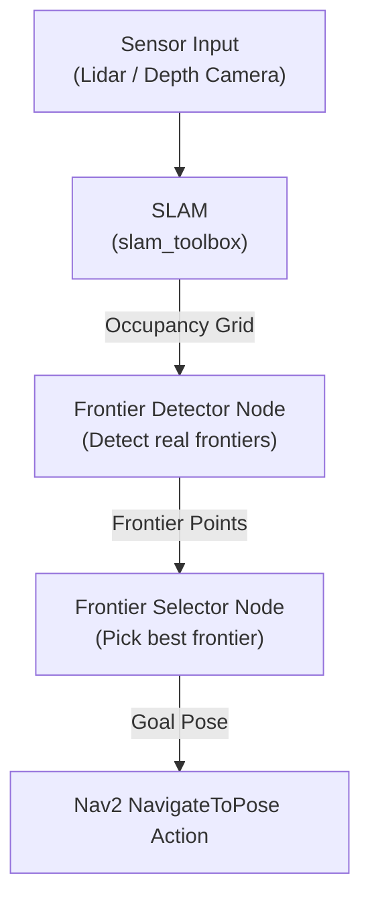

# Frontier-Exploration
A modular ROS2 frontier-exploration framework that detects real frontier boundaries, clusters them, selects optimal navigation targets, and autonomously maps unknown indoor environments using Nav2 + SLAM.

## 🧠 What is Frontier-Based Exploration?
A frontier = boundary between known free space (0) and unknown space (-1) in the map.
Robots explore by repeating
1. Detecting frontiers
2. Clustering frontier edges
3. Picking the best cluster
4. Navigating to its centroid
5. Discovering new areas
6. Repeating until map is complete

This method is:
1. Efficient
2. Intelligent
3. Industry-standard (used in warehouse & search robots)

## 📚 SYSTEM ARCHITECTURE



## 📂 Folder Structure
```text
frontier_exploration/
│
├── package.xml
├── setup.py
├── setup.cfg
│
├── launch/
│   └── frontier_explorer.launch.py
│
└── frontier_exploration/
    ├── __init__.py
    ├── map_listener.py
    ├── frontier_detector.py
    ├── frontier_selector.py
```

## ✅ Prerequisites & What You Should Have Installed

Before starting, make sure you have:

1. ROS 2 (e.g. Humble) installed.
2. Gazebo + gazebo_ros_pkgs installed (so simulation works)
3. SLAM package (e.g. slam_toolbox) installed.
4. Nav2 installed. 
5. The Frontier-Exploration repository cloned anf built
```bash
colcon build --symlink-install
source install/setup.bash
```

For a guide on above installations refer to [Setup/setup.md in ROS2-Autonomous-TurtleBot](https://github.com/shimmer0909/ROS2-Autonomous-TurtleBot) repository.

## 🚀 Launch the Full System

### 1️⃣ Start Simulation (Gazebo + sensors)

```bash
ros2 launch turtlebot3_gazebo turtlebot3_house.launch.py
```

### 2️⃣ Start SLAM

```bash
ros2 launch slam_toolbox online_sync_launch.py use_sim_time:=true
```

### 3️⃣ Start Nav2

```bash
ros2 launch nav2_bringup navigation_launch.py use_sim_time:=true
```

### 4️⃣ Start RViz

```bash
rviz2 -d /opt/ros/humble/share/nav2_bringup/rviz/nav2_default_view.rviz
```

### 5️⃣ Start Frontier Explorer

```bash
ros2 launch frontier_exploration frontier_explorer.launch.py use_sim_time:=true
```

## 🧩 How the Nodes Work

### map_listener.py
1. Subscribes to /map
2. Stores latest occupancy grid
3. Makes map available for other nodes

### frontier_detector.py
1. Detects real frontier cells:
2. Frontier = free cell adjacent to at least one unknown cell
3. Converts grid cells → world coordinates
4. Publishes frontier list as PoseArray on:
```bash
/frontier_list
```

Triggers detection when:
1. Map first loads
2. A frontier is reached (/frontier_reached)

### frontier_selector.py
1. Receives frontier list
2. Clusters frontiers (BFS connected-component method)
3. Selects best cluster based on:
```ini
cost = distance – 0.5 * cluster_size
```
4. Sends centroid to Nav2 using NavigateToPose action
5. Publishes:
```bash
/frontier_reached
```
when goal succeeds → triggers next frontier.

## 🔗 Important Topics

| Topic               | Type              | Description                                   |
|---------------------|-------------------|-----------------------------------------------|
| /map                | OccupancyGrid     | SLAM-generated map                            |
| /frontier_list      | PoseArray         | Detected frontier points                      |
| /frontier_reached   | Bool              | Notifies detector to generate next frontier   |
| /tf                 | transform tree    | Needed for robot pose                         |
| /tf_static          | static transforms | Needed for map → base_link                    |
| Nav2 Action         | NavigateToPose    | Executes goal-poses                           |


## ✅ Different Ways to Cluster Frontiers (From Basic → Advanced)

### 1. Grid-Based Clustering (Block/Grid Method)

**How it works:**
1. Divide the map into fixed blocks, e.g., 20×20 or 50×50 cells.
2. If a block contains frontier cells → take its center as the frontier cluster point.

**Pros:**
1. Fastest method
2. Zero dependencies
3. Very simple
4. Works well for large maps

**Cons:**
1. Not accurate
2. Cluster location may not be exactly at frontier
3. May create many bad/empty clusters

**Use when:**
1. You need speed over accuracy
2. You don’t want sklearn dependency
3. Your map is large and open

### 2. BFS / Flood Fill Clustering (Connected Component Clustering) - Used in this repository

**How it works:**
1. Treat frontier grid cells as “nodes”
2. Use BFS or DFS to group connected frontier cells into a frontier cluster
3. Compute centroid of each cluster

**Pros:**
1. Very accurate
2. Boundaries are clean
3. No ML library needed
4. Deterministic

**Cons:**
1. Slightly slower than grid-based
2. Still fast enough for real robots

**Use when:**
1. You want correct, meaningful frontiers
2. You want optimal exploration performance
3. This is used in most research papers.

### 3. K-Means Clustering (ML Method)

**How it works:**
1. Treat frontier coordinates as (x,y) points
2. Use KMeans(n_clusters = k)
3. K defined manually or heuristically

**Pros:**
1. Very simple to implement
2. Very fast with few points
3. Works well if you choose K properly

**Cons:**
1. Requires choosing K
2. Does NOT respect connected frontiers
3. Can merge unrelated edges
4. Possible invalid (inside wall) centroids

**Use when:**
1. Frontier count is large and scattered
2. You want a middle-ground heuristic
3. You're OK with approximate cluster centers

### 4. DBSCAN (Density-Based Clustering)

**How it works:**
1. DBSCAN groups points based on density
2. Automatically finds cluster shape

**Pros:**
1. Best-performing ML clusterer
2. Does not need K
3. Respects frontier structure
4. Can handle long curved frontiers
5. Rejects noise effectively

**Cons:**
1. Needs sklearn
2. Requires tuning eps (distance) & min_samples

**Use when:**
1. Map is complex
2. Frontiers are long and irregular
3. You want performance close to research systems

### 5. Hierarchical Clustering (Agglomerative)

**How it works:**
1. Bottom-up grouping
2. You choose distance threshold for merging

**Pros:**
1. Accurate
2. Good cluster shapes
3. No need for K

**Cons:**
1. Computationally expensive
2. Rarely needed for robots

**Use when:**
1. You’re doing research & want flexibility
2. Clusters must be shape-sensitive

### 6. Voronoi-Based Clustering (Advanced SLAM)

**How it works:**
1. Build Voronoi diagram of free space
2. Project frontier cells onto nearest Voronoi edges
3. Cluster based on Voronoi segmentation

**Pros:**
1. Optimal path planning
2. Avoids walls/obstacles
3. Very efficient navigation

**Cons:**
1. Very complex
2. Requires additional libraries

**Use when:**
1. Writing a paper / advanced robotics research
2. Multi-robot exploration
